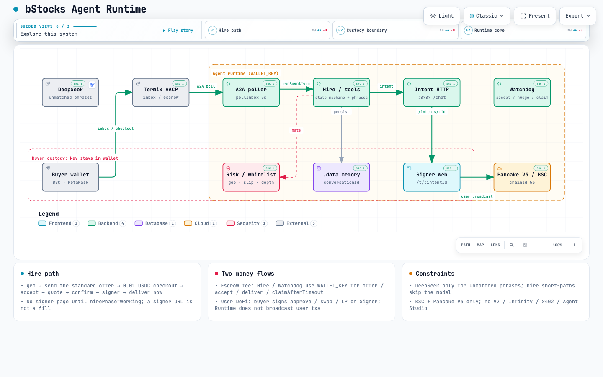
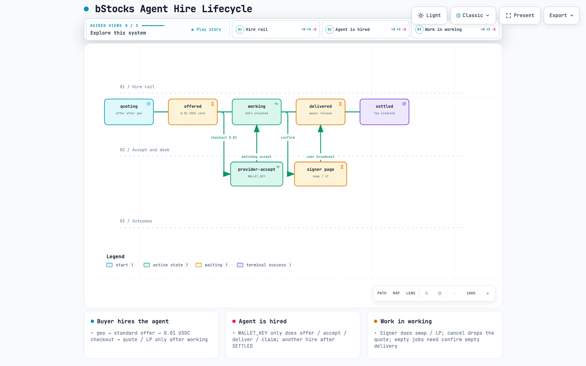
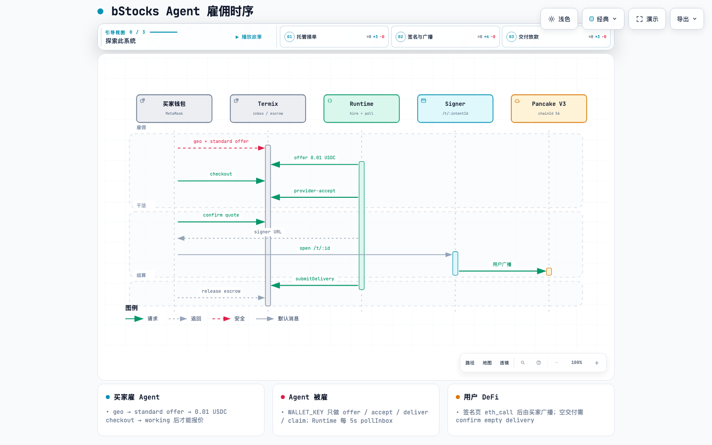

# bStocks Agent

A non-custodial BNB Chain agent: buy and sell whitelist [bStocks](https://bstocks.com/) in plain language, and add or manage PancakeSwap **V3-only** liquidity. It runs on [Termix](https://docs.termix.ai/). Buyers sign with their own wallet. The agent never holds that key.

Storefront: [agent.family/agents/315840](https://www.agent.family/agents/315840). Listing copy is English. The LLM replies in the user's language: Chinese if they write Chinese, English otherwise. Spoken names such as NVIDIA / 英伟达 / NVDA all map to the same whitelist row (`NVDAB`).

> Not investment advice. No yield or APR is promised. bStocks are certificate-style exposure, not the underlying stock, and have no voting rights. Unavailable in the United States and restricted regions.

## What it does

- **Hire (Termix)**: geo → `send the standard offer` → 0.01 USDC escrow checkout → agent accepts → quote → signer page → `deliver now`. Same chat again: `another hire`.
- **Quote / swap**: `buy 10 USDT of NVDAB`, `buy NVDAB with 0.05 BNB`, `sell 0.5 NVIDIA`. Native BNB and WBNB stay separate.
- **Compare LP APR**: `NVIDIA highest apr`. Pancake Explorer BSC V3 only, quote assets USDT / USDC / WBNB, thin pools flagged. The number is 24h **fee APR**, not your position return, and not a promise.
- **Mint LP**: default `NVDAB / USDT 0.25%`, range ±30%. Or pick a tier: `add 100u to the highest`, `add 100u NVIDIA WBNB 0.25%`. Confirm uses the same quote + fee.
- **Manage positions**: `my positions`, `collect`, `withdraw half`, `withdraw all`. List NFTs first, then wait for confirm.
- **Cancel**: `cancel` only drops the pending quote and unsigned signer page. It does not cancel a Termix hire or an already-broadcast fill.

Default slippage is 50 bps (cap 80 bps). Notional, pool liquidity, and deviation limits live in `config/risk.json`.

On a Termix thread the signer page waits until the hire is **working**. A signer URL is not a fill. `deliver now` with no on-chain hash asks once; `confirm empty delivery` closes the job.

## Buyer path

Storefront (Termix):

1. `I confirm I am not in the United States or a restricted region`
2. `send the standard offer` — accept the **0.01 USDC** card and finish checkout (service fee, not a stock purchase)
3. After the agent accepts: `buy 10 USDT of NVDAB`
4. `confirm` — open the signer page with the **bound wallet**
5. After broadcast: `deliver now`. If you never traded: `confirm empty delivery`
6. Accept delivery on Termix to release escrow. Same chat later: `another hire`

Local `/chat` skips hire and can quote after geo + a `0x` address:

```bash
pnpm dev:runtime    # :8787  intents + /chat
pnpm dev:signer     # :3000  signer page
pnpm chat           # terminal chat, conversation=local
```

Without `DEEPSEEK_API_KEY`, the rule phrases (offer / quote / mint / positions / confirm / deliver) still work. With a key, DeepSeek drives tool calls (`deepseek-v4-flash` by default).

The signer page runs `eth_call` and estimates gas first. A hard fail blocks confirm. Approves are bounded, `amountMin` must not be 0, and the deadline is short.

## Two money flows

| | Who signs | What it does |
| --- | --- | --- |
| Termix escrow (0.01 USDC) | Agent wallet `WALLET_KEY` | Offer, accept, deliver, `claimAfterTimeout` |
| User DeFi | User wallet (signer page) | approve / swap / mint / collect / decrease |

The agent **does not** have the user key and does not broadcast user DeFi txs. Contracts use ERC-8056 **raw**; chat and reports use UI shares.

Settlement is Termix escrow in **USDC** (platform default). No BNB Agent Studio, no x402. BSC (chainId 56) and Pancake V3 only. No V2 / Venus / Lista.

## Architecture

Runtime: Termix inbox → hire state machine → intent HTTP → signer page → buyer broadcast on BSC. The agent wallet (`WALLET_KEY`) stays inside the runtime boundary. The buyer key never leaves the wallet / signer page.



Interactive: [runtime diagram](docs/archify/bstocks-runtime.html). Spec: [`bstocks-runtime.architecture.json`](docs/archify/bstocks-runtime.architecture.json).

## Hire lifecycle

Buyer hires the agent: `quoting` → `offered` → `working` → `delivered` → `settled`. Being hired is the side path: checkout 0.01 USDC → Watchdog `provider-accept` with `WALLET_KEY`. Desk work is the other side path: `confirm` → signer page (swap / LP) → user broadcast → `delivered`.

`funded` sits between checkout and `working`. `cancel` only drops the quote. Empty delivery needs `confirm empty delivery`. After `SETTLED`, `another hire` starts a new cycle. 48h with no release: `claimAfterTimeout`.



Interactive: [hire lifecycle](docs/archify/bstocks-hire.html). Spec: [`bstocks-hire.lifecycle.json`](docs/archify/bstocks-hire.lifecycle.json).

## Hire sequence

Same story as a call chain: buyer ↔ Termix ↔ Runtime for escrow, then buyer → signer → Pancake V3 for the fill, then `submitDelivery` and release.



Interactive: [hire sequence](docs/archify/bstocks-hire-sequence.html). Spec: [`bstocks-hire.sequence.json`](docs/archify/bstocks-hire.sequence.json).

## Whitelist

Tokens and pools live in `config/tokens.json` and `config/pools.json`, not hardcoded. On-chain `symbol()` was checked on 2026-08-26.

bStocks: NVDAB, TSLAB, CRCLB, MUB, SNDKB, SPCXB, AMDB, EWYB, INTCB, MSTRB, LITEB, METAB, MSFTB, PLTRB, QQQB.  
Quote assets: USDT, USDC, WBNB (spoken BNB is native gas).

Quotes compare `amountOut` across `preferredFee` + `feeTiers`, then two-hop via `USDT → USDC → WBNB` if needed. V3 pools not listed in `pools.json` (e.g. NVDAB/WBNB) are resolved at runtime with Factory `getPool`.

## Risks (repeated in chat, listing, and delivery)

- Not investment advice. No APR is promised.
- US and restricted regions are blocked. No trade intent without a geo confirm.
- LP has impermanent loss. Tighter ranges exit range more easily and stop earning fees.
- Off US-market hours, on-chain price may deviate from the underlying.
- Thin-pool APR is informational only and cannot be minted as “highest”.
- The user signs and bears the outcome.

## Local development

Node 20+, pnpm 10+, and a stable BSC RPC (public nodes are fine locally).

```bash
corepack enable
pnpm install
cp .env.example .env
pnpm typecheck
pnpm test
```

Read-only quote / calldata (no broadcast by default):

```bash
pnpm quote -- --in USDT --out NVDAB --amount 10
pnpm swap-intent -- --in USDT --out NVDAB --amount 10 --user 0xYourAddress
pnpm lp-intent -- --token NVDAB --amount 0.01 --user 0xYourAddress
```

Production signer: https://signer-web-phi.vercel.app  
Links sent to buyers use `SIGNER_WEB_URL`. Intent data still comes from Runtime. An HTTPS signer cannot call `http://127.0.0.1`, so set `NEXT_PUBLIC_RUNTIME_URL` to a public Runtime in production.

`GET /health` reports `serviceFee` (from `listingDraft()`) and A2A heartbeat (`tokenIssued`, `polling`, `lastPollAt`).

### Conversation memory

Termix inbox sends **only the buyer’s new sentence**. Runtime persists by `conversationId`:

1. Memory card: geo, wallet, hire phase, offer/order ids, pending quote / LP tier, last signer page
2. Last 24 turns
3. Inbox cursor + `messageId` idempotency; a new thread with the same `orderId` inherits wallet and geo

Data lives at the repo root `.data/` (not `apps/runtime/.data`). Local `/chat` defaults to `conversationId=local`. Use `source=termix` on `/chat` only to exercise hire gates; that path must not send a live offer.

### Environment

See `.env.example`. Secrets stay in `.env` and are not committed.

| Variable | Use |
| --- | --- |
| `BSC_RPC_URL` | BSC JSON-RPC |
| `WALLET_KEY` | Termix agent wallet **only**. Local quotes / signer do not need it |
| `BUYER_WALLET_KEY` | Second wallet for hire e2e. Must differ from `WALLET_KEY` |
| `DEEPSEEK_API_KEY` | Natural-language tool calls |
| `A2A_LLM_MODEL` | Default `deepseek-v4-flash` |
| `TERMIX_AGENT_ID` | Set after mint; A2A poller idles without it |
| `TERMIX_LISTING_ID` | Live listing to PATCH / hire against |
| `LISTING_BASE_PRICE` | Storefront fee, default `0.01` USDC |
| `SIGNER_WEB_URL` | Signer-page prefix sent to buyers |
| `NEXT_PUBLIC_RUNTIME_URL` | Signer reads intents from here |

Termix contract addresses are fetched from `GET /api/v1/config/contracts` at startup.

## Termix go-live

The repo does not mint or publish by itself. Scripts are dry-run unless you pass `--broadcast` / `--publish` / `--update` with `WALLET_KEY` set.

```bash
pnpm termix:mint                    # handle: bStocks → bStocks.agent (set once)
pnpm termix:listing                 # print draft
pnpm termix:listing -- --update     # PATCH the live listing (do not create a second one)
pnpm termix:e2e-hire                # dry-run hire
pnpm termix:e2e-hire -- --via-agent --broadcast --skip-defi
pnpm termix:claim-watch
```

Live listing: `cmtdjaletb3yftg012bh5xma2`, `instantBuyable=false`, **0.01 USDC**, delivery 3 days. Category: Automation & Ops.

Termix has **no** auto-settle. After `DELIVERED` and the challenge window, someone must call `claimAfterTimeout` or the fee stays in escrow. Runtime has a watchdog; you can also run `pnpm termix:claim-watch`.

## Layout

| Path | Role |
| --- | --- |
| `apps/runtime` | A2A poll, hire state machine, LLM tools, intent HTTP, order watchdog, local `/chat` |
| `apps/signer-web` | Next.js + wagmi, `/t/:intentId`, BSC only; simulate + gas |
| `packages/chain` | Whitelist, ERC-8056, V3 quote / swap / LP, Explorer APR compare |
| `packages/termix` | AACP REST |
| `packages/risk` | Whitelist, slippage, size, liquidity, deviation, geo latch |
| `packages/report` | Delivery Markdown / JSON |
| `config/*.json` | Tokens, pools, risk |

The agent does not broadcast user fills on mainnet. Quotes use public RPC; occasional timeouts are expected.
